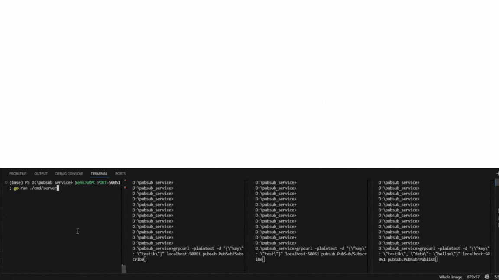

# gRPC Pub/Sub Service
Микросервис для подписки и публикации событий через gRPC с гарантией порядка доставки.

## Особенности сервиса
- Подписка на события по ключам
- Асинхронная доставка сообщений
- Гарантия порядка (FIFO)
- Graceful shutdown – Корректное завершение работы с обработкой текущих задач
- Логирование операций
- Конфигурация через YAML

## Стек технологий
- **Go**: Основной язык разработки.
- **gRPC**: Для взаимодействия клиента и сервера.
- **Protocol Buffers**: Определение API и генерация кода.

## Пример использования

## Установка

### Требования
- Go 1.20+
- Protobuf Compiler (`protoc`)

### Прежде всего, клонируем репозиторий к себе:
```bash
git clone https://github.com/Kweall/PubSubService
```
### Установим зависимости
```bash
go install google.golang.org/protobuf/cmd/protoc-gen-go@v1.28
go install google.golang.org/grpc/cmd/protoc-gen-go-grpc@v1.2
go mod init pubsub_service
go mod tidy
```
### Запуск проекта
#### Генерируем proto
```bash
make generate
```
#### Создаем бинарный файл/Запускаем проект
```bash
make build/make run
```
### Запуск сервера
```bash
GRPC_PORT=50051 go run cmd/server/main.go
```
### Запуск тестового клиента
```bash
go run cmd/client/main.go
```
### Запуск клиентов альтернативным способом
```bash
grpcurl -plaintext -d "{\"key\": \"test\"}" localhost:50051 pubsub.PubSub/Subscribe
```
## Запуск отправки сообщения по ключу
```bash
grpcurl -plaintext -d "{\"key\": \"test\", \"data\": \"hello\"}" localhost:50051 pubsub.PubSub/Publish
```
### Запуск unit-тестов
```bash
go test -v ./internal/infra/subpub -cover
```
# Процент покрытия: 89.3%


### Пример файла .env:

```bash
GRPC_PORT=50051
```
